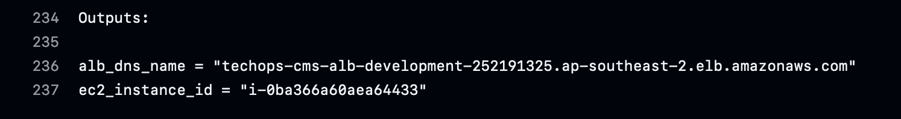
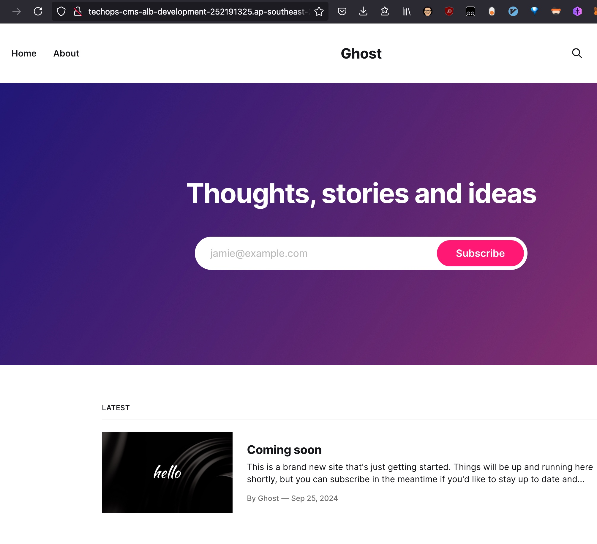

# Ghost Blog Setup with Automated CI/CD Pipeline

---

## Architecture Overview

The Ghost hosting solution is focused on security and efficient management. It features an AWS EC2 instance running the Ghost blog application within a private subnet of a Virtual Private Cloud (VPC). By isolating the instance from direct internet access, security is enhanced by reducing exposure to external threats. User traffic from the internet is directed to an Application Load Balancer (ALB) located in public subnets. The ALB acts as the gateway, accepting HTTP requests and forwarding them to the EC2 instance in the private subnet. The Ghost application and its dependencies are managed using Docker Compose on the EC2 instance, streamlining deployment and container orchestration. Administrative access to the EC2 instance is securely facilitated via SSH using the AWS Systems Manager (SSM) Session Manager proxy. This method eliminates the need to open SSH ports to the internet, allowing administrators to manage the instance securely through SSM.

- **AWS EC2 Instance**: Hosts the Ghost blog application in Docker containers.
- **AWS IAM Roles and Policies**: Manage permissions for AWS resources and services.
- **AWS SSM (Systems Manager)**: Enables secure communication and file synchronization with the EC2 instance.
- **GitHub Actions**: Automates the CI/CD pipeline for infrastructure changes and content updates.
- **Terraform**: Manages AWS infrastructure as code.
- **Docker compose**: Manages Ghost and dependencies.

---

## Prerequisites

- **AWS Account**: Access to create IAM users, s3 bucker, dynamodb table, vpc, ec2 instance, alb and other resources.
- **GitHub Account**: To host the repository and run GitHub Actions workflows.
- **Git Installed Locally**: For cloning and managing the repository.
- **AWS CLI Installed Locally**: Optional, for manual AWS interactions.

---

## Setup Guide

### 1. Prepare AWS Credentials

#### 1.1. Create an IAM User

1. **Login to AWS Console**.
2. **Navigate to IAM Service**.
3. **Create a New User**:
  - Click on **"Users"** > **"Add users"**.
  - **User Name**: `ghost_user`.
  - **Access Type**: Check **"Programmatic access"**.
4. **Attach Policies**:
  - Choose **"Attach existing policies directly"**.
  - Attach the following policies:
    - **AmazonS3FullAccess**
    - **AmazonEC2FullAccess**.
    - **AmazonSSMFullAccess**.
    - **AmazonIAMFullAccess**.
    - **AmazonSSMManagedInstanceCore**.
5. **Download Credentials**:
  - Save the **Access Key ID** and **Secret Access Key** securely.
6. **Setup the AWS configuration**

  Create local credential file  `$HOME/.aws/credentials`  as follows:

  ```
  [ghost_user]
  aws_access_key_id = $AWS_ACCESS_KEY_ID
  aws_secret_access_key = $AWS_SECRET_ACCESS_KEY
  ```
  
#### 1.2. Create an S3 Bucket

  ```bash
  aws --profile ghost_user s3api create-bucket --bucket $YOUR_BUCKET_NAME --region ap-southeast-2 --create-bucket-configuration LocationConstraint=ap-southeast-2 --profile
  ```

#### 1.3. Create Dynamodb Table

  ```bash
  aws --profile ghost_user dynamodb create-table \                                                                                                                                                             
    --table-name $YOUR_LOCK_TABLE \
    --attribute-definitions AttributeName=LockID,AttributeType=S \
    --key-schema AttributeName=LockID,KeyType=HASH \
    --provisioned-throughput ReadCapacityUnits=5,WriteCapacityUnits=5
  ```

### 2. Generate SSH Key Pair

#### 2.1. On Your Local Machine

1. **Generate SSH Key Pair**:

   ```bash
   ssh-keygen -t ed25519 -C "TechOps" -f ~/.ssh/techops
   ```

### 3. Set Up GitHub Repository

#### 3.1. Clone the Repository

1. **Create a New Repository** on GitHub: `your-username/ghost-blog`.
2. **Clone the Repository**:

   ```bash
   git clone git@github.com:onionisi/techops_test.git
   ```

#### 3.2. Repository Files

- **Directory Structure**:

  ```
  techops_test/
  ├── .github/
  │   └── workflows/
  │       └── main.yml
  ├── terraform/
  │   ├── main.tf
  │   ├── variables.tf
  │   ├── provider.tf
  │   ├── outputs.tf
  │   └── userdata.sh 
  ├── ghost_content/
  │   └── [Your Ghost content files]
  └── README.md
  ```

#### 3.3. Customise Code

- Terraform Code 

	- Update the [bucket]( https://github.com/onionisi/techops_test/blob/main/terraform/provider.tf#L8) with the newly created bucket name in [1.2](#12-create-an-s3-bucket).
	- Update the [dynamodb_table]( https://github.com/onionisi/techops_test/blob/main/terraform/provider.tf#L11) with the newly created table name in [1.3](#13-create-dynamodb-table).

- userdata.sh (Optional)

  - user creation, the default new user name is [ghostuser](https://github.com/onionisi/techops_test/blob/main/terraform/userdata.sh#L15)
  - [docker compose](https://github.com/onionisi/techops_test/blob/main/terraform/userdata.sh#L43-L90) with volume mapping
  - [backup Script](https://github.com/onionisi/techops_test/blob/main/terraform/userdata.sh#L107-L137)

#### 3.4. Configure GitHub Secrets

1. **Navigate to Repository Settings** > **"Secrets and variables"** > **"Actions"**.
2. **Add the Following Secrets**:

  - `AWS_ACCESS_KEY_ID`: From IAM User credentials.
  - `AWS_SECRET_ACCESS_KEY`: From IAM User credentials.
  - `SSH_PRIVATE_KEY`: From private techops key  `cat ~/.ssh/techops | xclip -sel clip`.
  - `SSH_PUBLIC_KEY`: From public techops key  `cat ~/.ssh/techops.pub | xclip -sel clip`.
  - `INSTANCE_ID`: Placeholder, should be updated manually with the terraform output.

### 4. Test the CI/CD Pipeline

1. **Make a Change to `terraform/` or `ghost_content/`**:

  - Commit and push changes to a new branch.
  - Open a pull request against `main`.

2. **Observe GitHub Actions**:
	
  - The `terraform-plan` job should run if changes were made in `terraform`, showing the plan in the logs.[Link](https://github.com/onionisi/techops_test/actions/runs/11024851652/job/30618719264)

3. **Merge Pull Request**:

  - Upon merging, the `deploy` job should run.
  - If changes were made in `terraform/`, Terraform apply should execute. [Link](https://github.com/onionisi/techops_test/actions/runs/11023719369/job/30616185154) 
  - If changes were made in `ghost_content/`, the content sync should execute. [Link](https://github.com/onionisi/techops_test/actions/runs/11024744856/job/30618611458)

4. **Verify Deployment**:

  - Check the EC2 instance to ensure changes have been applied.
    - [Setup ssh with ssm proxy](https://docs.aws.amazon.com/systems-manager/latest/userguide/session-manager-getting-started-enable-ssh-connections.html#ssh-connections-enable)

      ```
      # SSH over Session Manager
      host i-* mi-*
        ProxyCommand sh -c "aws ssm start-session --target %h --document-name AWS-StartSSHSession --parameters 'portNumber=%p'"
      ```

    - Fetch the instance id from the ec2_intance_id output of terraform apply step

      ```bash
      export AWS_PROFIEL=ghost_user
      ssh ghostuser@$INSTANCE_ID`
      ```

  - Access the Ghost blog via the alb_dns_name output from terraform apply to confirm it's running correctly.

  
  

### 5. Future improvement or todo

1. Customised domain with TLS termination on ALB.
2. Email sending resitriction remove request or just sending local
3. Scalability improvement with ECS or EKS.
4. Monitoring and logging enhancement with CloudWatch
5. Fine grained access control with iam role
